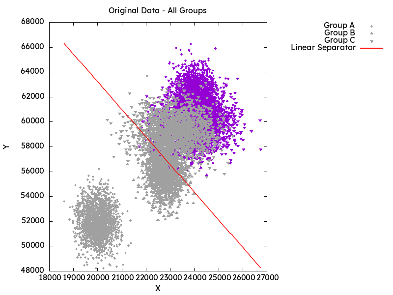

# Data Processing & Visualization

AI project implementing linear classifiers with confusion matrix analysis.

Uses Nix for development environment.

## Setup
```bash
# With direnv
direnv allow

# Without direnv
nix develop
```

## File Structure
```
Data/
├── groupA.txt, groupB.txt, groupC.txt          # Raw CSV data (classes 0,1)
└── normalized/                                 # Normalized output (0-1 range)
scripts/
├── normalize.go                                # Data normalization
├── confusion_matrix.go                         # Confusion matrix analysis
├── plot.fish                                   # Data visualization
└── plot_confusion.fish                         # Confusion matrix plots
plots/                                          # Generated images
├── original_data.png
├── groupA.png, groupB.png, groupC.png
└── normalized/                                 # Normalized data plots
    ├── normalized_data.png
    ├── groupA.png, groupB.png, groupC.png
    └── confusion/                              # Confusion matrix results
        ├── analysis_results.txt                # Detailed metrics
        ├── groupA.dat, groupB.dat, groupC.dat
        └── groupA.png, groupB.png, groupC.png
run_analysis.fish                               # Complete pipeline script
flake.nix                                       # Nix development environment
```

## Usage

### Quick Start (Full Pipeline)
```bash
./run_analysis.fish
```

### Individual Scripts
- `go run scripts/normalize.go` - Normalizes data to 0-1 range
- `go run scripts/confusion_matrix.go` - Generates confusion matrices for normalized data
- `./scripts/plot.fish` - Generates scatter plots with linear separators
- `./scripts/plot_confusion.fish` - Creates confusion matrix heatmaps

## Classification
- **Original data**: `y > -2.22*x + 107643` → Big Car (1), else Small Car (0)
- **Normalized data**: `y > -x + 1` → Big Car (1), else Small Car (0)
- **True Positive**: Correctly identified big cars (class 1)

## Results

### Data Visualization

*All groups with diagonal separator*


*Normalized data with linear classifier*

### Individual Groups
| Group A | Group B | Group C |
|---------|---------|---------|
|  |  |  |

### Confusion Matrices
| Group A | Group B | Group C |
|---------|---------|---------|
|  |  |  |